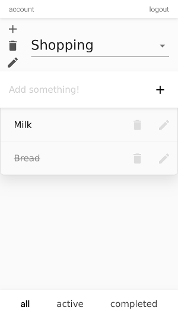

# Simple Todo list



This is a simple todo list written in javascript using express for the backend and react+redux for the frontend.
It also can work offline, thanks to redux-offline (without any conflict resolving, though). The code is of somewhat questionable quality, so you probably don't want to use it as a reference.

Check it out at https://ustk-todolist.herokuapp.com/

## Getting started

Start with `npm run dev`

create-react-app server will be listening at http://localhost:3000, with proxy to the backend at localhost:4000

## Configuration

By default development server uses mongodb `todolist` database at localhost, you can change it with environment variable `DB_URI`

If you are running it in production environment, you should set these environment variables:

```
HSTS = true/false
DB_URI (or MONGODB_URI)
PORT
SECRET
HOST
```

There is google OAuth support, which can be enabled by setting `GOOGLE_ENABLED` variable to true, however for it to actually work you must also set `GOOGLE_CLIENT_ID` and `GOOGLE_CLIENT_SECRET`

## Offline

The create-react-app's service worker works only in production environment.
You can build the frontend with `cd react && npm run build`.

In production mode, express is listening at http://localhost:4000 and serving the built frontend.
